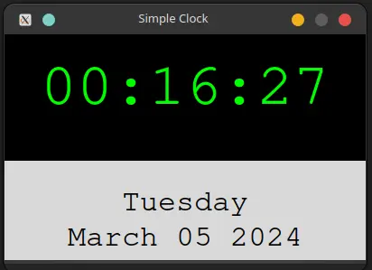

# Time and Date Display with Tkinter

This Python script creates a graphical user interface using Tkinter to display the current time, day of the week, and date. The time is updated every second.

## Requirements

- Python 3.x
- Tkinter (usually comes pre-installed with Python)



## Usage

1. Clone the repository or download the script:
    ```bash
    git clone https://github.com/Wayfarerdesert/pyClock
    ```
    Or download the script directly from the repository.

2. Run the script using Python:
    ```bash
    main.py
    ```

3. The GUI window will display the current time, day of the week, and date.

4. The time is updated every second.


## Features

- Displays current time in hours, minutes, and seconds.
- Displays the day of the week.
- Displays the current date in the format "Month Day, Year".
- Time updates automatically every second.

## File Structure

- `main.py`: The main Python script that creates the GUI and updates the time.
- `README.md`: This file, providing an overview of the project.

